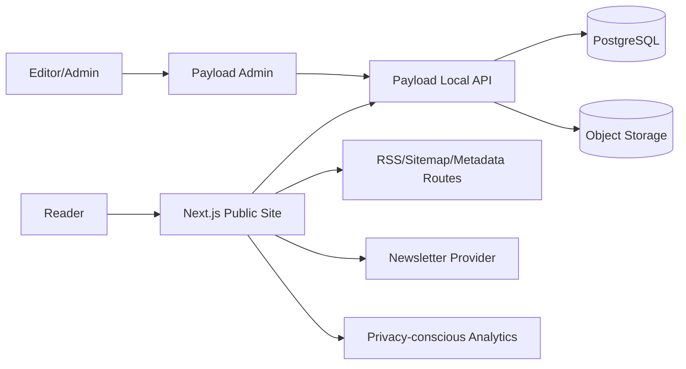

# Kovasz Architecture Decision Document

This is a fast-path architecture draft. The formal BMad architecture workflow normally pauses for confirmation between steps; this document captures a recommended baseline so implementation can be estimated and reviewed.

## 1. Architecture Summary

Build Kovasz as a content-first Next.js application with Payload CMS embedded in the same TypeScript codebase, backed by PostgreSQL and object storage for media. Public pages use the Next.js App Router for server-rendered/static content, metadata, sitemap, RSS route handlers, and preview support. Payload provides admin UI, auth, collections, rich text, uploads, access control, and APIs.

Recommended stack:

| Layer      | Choice                                             | Reason                                                                             |
| ---------- | -------------------------------------------------- | ---------------------------------------------------------------------------------- |
| Web app    | Next.js App Router + TypeScript                    | SEO, server rendering, route-level metadata, static/dynamic mix, strong React path |
| CMS/Admin  | Payload CMS                                        | Admin, auth, collections, rich text, media, REST/GraphQL/local APIs in one app     |
| Database   | PostgreSQL via Payload adapter                     | Relational consistency for Authors, Articles, Series, Categories, Tags, Resources  |
| Styling    | Tailwind CSS + small component library             | Keeps the custom editorial identity without heavy UI abstraction                   |
| Rich text  | Payload Lexical rich text                          | Needed for long theological articles, quotes, footnotes, callouts                  |
| Media      | Payload upload collection + object storage         | Cover images, author photos, PDFs, resources                                       |
| Search MVP | PostgreSQL full-text search or Payload query layer | Enough for small/medium publication; defer Meilisearch/Algolia                     |
| Email      | Provider adapter, initially Resend or Mailerlite   | Newsletter capture without building mail infrastructure                            |
| Testing    | Vitest for units, Playwright for critical flows    | Public routing, search, article rendering, admin publish flow                      |

## 2. Why Not Keep React SPA + Separate FastAPI by Default

`PROJECT.md` mentions React SPA plus a planned FastAPI/MongoDB backend. That can work, but it adds seams the MVP does not need:

- Public content needs crawlable pages, metadata, sitemap, RSS, and Open Graph. A client-rendered SPA makes this harder.
- Admin, auth, rich text, media, and data model are standard CMS concerns. Building them from scratch in FastAPI will cost time.
- The project is content-heavy, not API-product-heavy. A single TypeScript app reduces coordination overhead.

FastAPI remains a valid future service if Kovasz later needs specialized APIs, Bible integrations, recommendation pipelines, or PDF generation workers. It should not be the default MVP backend unless there is a separate non-CMS requirement.

## 3. System Context



## 4. Deployment Shape

MVP can deploy as one application service plus managed infrastructure:

- `web`: Next.js app with Payload route group and public route group.
- `db`: managed PostgreSQL.
- `media`: S3-compatible object storage or hosting provider blob storage.
- `email`: external provider.
- `analytics/error`: lightweight analytics and error capture.

For local development:

- `pnpm dev` starts Next.js/Payload.
- Docker Compose can provide PostgreSQL.
- Local media storage can use filesystem in development.

## 5. Recommended Route Structure

```text
app/
  (site)/
    layout.tsx
    page.tsx
    cikkek/
      page.tsx
      [slug]/page.tsx
    sorozatok/
      page.tsx
      [slug]/page.tsx
    topics/
      page.tsx
      [slug]/page.tsx
    audiences/
      page.tsx
      [slug]/page.tsx
    napi-ige/page.tsx
    forrasok/page.tsx
    kereses/page.tsx
    rolunk/page.tsx
    szerzok/[slug]/page.tsx
  (payload)/
    admin/...
    api/...
  rss.xml/route.ts
  sitemap.ts
  robots.ts
  opengraph-image.tsx
src/
  collections/
  components/
  features/
  lib/
  styles/
  tests/
```

Route names can remain Hungarian publicly. Internal folders may use ASCII if preferred, but public URLs should match the Hungarian IA.

## 6. Content Model

### 6.1 Collections

| Collection        | Key Fields                                                                                                                                                        |
| ----------------- | ----------------------------------------------------------------------------------------------------------------------------------------------------------------- |
| Users             | email, password/session fields, role                                                                                                                              |
| Authors           | name, slug, role, bio, photo, links, active                                                                                                                       |
| Categories        | title, slug, description, color/accent                                                                                                                            |
| Tags              | title, slug                                                                                                                                                       |
| Topics            | title/name, slug, description, active/status                                                                                                                       |
| Audiences         | title/name, slug, description, active/status                                                                                                                       |
| Series            | title, slug, description, coverImage, status, SEO, orderedArticles, topic, audience                                                                               |
| Articles          | title, slug, subtitle, excerpt, body, author, category, tags, topic, audience, series, seriesOrder, scriptureReferences, coverImage, featured, status, publishedAt, updatedAt, SEO |
| DailyVerses       | date, scriptureText, reference, note, status                                                                                                                      |
| Resources         | title, slug, type, description, fileOrUrl, relatedArticles, relatedSeries, tags, status                                                                           |
| Media             | file, alt, caption, credit, focalPoint                                                                                                                            |
| Redirects         | fromPath, toPath, permanent                                                                                                                                       |
| NewsletterSignups | email, source, createdAt, consent                                                                                                                                 |
| SiteSettings      | homepage curation, issue label, navigation, footer, social links                                                                                                  |

### 6.2 Relationships

- Article has one Author.
- Article has one Category.
- Article has many Tags.
- Article can reference shared Topics and Audiences.
- Article has zero or one primary Series.
- Series has many Articles through explicit order.
- Series can reference shared Topics and Audiences and should expose ordered membership back to Article Detail.
- Resource can reference Articles and Series.
- Resource can reference shared Topics and Audiences while preserving legacy text fields during migration.
- Media can attach to Articles, Authors, Series, and Resources.

## 7. Publishing Workflow

Content status values:

- `draft`
- `review`
- `scheduled`
- `published`
- `archived`

MVP roles:

- **Admin:** manage settings, users, all content.
- **Editor:** manage content, publish articles, manage media.

Publishing behavior:

1. Editor creates or edits draft.
2. Editor previews draft.
3. Editor publishes or schedules.
4. Publish event triggers route revalidation for affected article, archive, series, homepage, sitemap, and RSS.
5. Slug changes create redirect records.

## 8. Rendering Strategy

| Surface         | Strategy                                                            |
| --------------- | ------------------------------------------------------------------- |
| Home            | Static or cached server rendering, revalidate after content updates |
| Article Detail  | Static/cached server rendering with dynamic metadata                |
| Article Archive | Server rendered with search params and pagination                   |
| Topic/Audience  | Dynamic server rendering over CMS-backed loaders with static fallback |
| Search          | Server rendered query page; client enhancement optional             |
| Admin           | Payload dynamic admin                                               |
| RSS/Sitemap     | Route handlers or metadata file conventions                         |

Next.js official docs support route-level metadata via `metadata` and `generateMetadata`, and sitemap generation via `sitemap.(xml|js|ts)`. Use those conventions instead of custom ad hoc files.

## 9. SEO and Syndication

Each public content page should include:

- Title and description.
- Canonical URL.
- Open Graph title, description, image.
- Article JSON-LD for Articles.
- Breadcrumb JSON-LD where useful.
- `lastModified` in sitemap.
- RSS item for published Articles.
- Topic and Audience index/detail routes in sitemap when they have public content.

Slug policy:

- Public URLs are stable.
- Slug changes create redirects.
- Deleted public content should archive/unpublish, not hard-delete by default.

## 10. Search Strategy

MVP:

- Store normalized searchable fields for Article, Series, Author, Resource, and DailyVerse.
- Use PostgreSQL full-text capabilities or Payload query filters.
- Support query plus filters for category, author, series, tag, and Scripture reference.
- Keep shared Topic and Audience taxonomy normalization in a server-side helper so cross-content discovery can aggregate Articles, Series, and Resources consistently.

Upgrade path:

- Add Meilisearch/Algolia only when result quality, typo tolerance, or scale requires it.
- Keep a search index abstraction so upgrade does not rewrite UI.

## 11. Media Strategy

- Use Payload upload collection for images and files.
- Require alt text for meaningful images.
- Store credit and caption.
- Generate responsive image sizes where supported.
- Keep grayscale visual treatment in CSS; store original image normally.
- PDFs/resources should be files with metadata, not arbitrary static assets.

## 12. Security and Privacy

- Use Payload auth or a hardened auth provider integrated with Payload access control.
- Store secrets in environment variables.
- Protect preview routes.
- Add CSRF/session protections according to framework/CMS defaults.
- Enforce role-based access at collection and field level.
- Collect minimal newsletter data.
- Add rate limiting for auth, search, and newsletter endpoints.
- Use secure headers and content security policy before production.

## 13. Accessibility Requirements

- Public pages and admin custom components target WCAG 2.2 AA.
- Article text must remain readable with browser zoom and mobile widths.
- Keyboard navigation must cover nav, search, filters, article utilities, and admin forms.
- Images require alt text.
- Focus rings visible on paper and dark surfaces.
- Forms need labels, descriptions, validation messages, and error summary.

## 14. Observability and Operations

Minimum:

- Error tracking for server and client.
- Web analytics that respect privacy.
- Admin action logging for publish/unpublish/delete.
- Database backups.
- Media backup or bucket versioning.
- Health check endpoint.

## 15. Testing Strategy

Unit tests:

- Slug generation.
- Reading time.
- Metadata builders.
- Search query parsing.
- Rich text rendering helpers.

Integration tests:

- Article publish updates public article.
- Series ordering.
- Daily Verse fallback.
- RSS/sitemap generated from published content only.

E2E tests:

- Reader opens homepage, article, series, search.
- Editor signs in, creates draft, previews, publishes.
- Mobile nav and search.

## 16. Key Architecture Decisions

### ADR-1: Use Next.js App Router for the public site

**Decision:** Use Next.js App Router as the main public web framework.

**Rationale:** Kovasz needs SEO, metadata, sitemap, RSS route handlers, server rendering, and React-based editorial UI.

**Consequences:** Implementation should avoid client-only SPA patterns for public content.

### ADR-2: Use Payload CMS for admin and content APIs

**Decision:** Use Payload CMS embedded in the Next.js app.

**Rationale:** MVP needs admin, auth, collections, rich text, media, roles, and APIs. Payload covers these without building a separate backend.

**Consequences:** Content modeling happens in TypeScript collection configs. Admin customization should stay minimal unless editorial workflow demands it.

### ADR-3: Use PostgreSQL for MVP persistence

**Decision:** Use PostgreSQL rather than MongoDB for the initial production architecture.

**Rationale:** Kovasz has relational content: authors, series, articles, categories, tags, resources, redirects, and newsletter signups. Payload officially supports Postgres through a database adapter.

**Consequences:** Migrations must be treated as part of deployment. Local development should include PostgreSQL.

### ADR-4: Defer comments

**Decision:** Exclude public comments from MVP.

**Rationale:** Comments require moderation policy, abuse handling, notification flows, and theological/editorial governance.

**Consequences:** Article pages can leave space for future discussion but should not implement it in v1.

### ADR-5: Keep search simple first

**Decision:** Start with database-backed search, abstracted behind a search function.

**Rationale:** Content volume is initially small, and external search adds operational cost.

**Consequences:** Keep API/UI ready for later search backend replacement.

## 17. Risks

| Risk                                          | Mitigation                                               |
| --------------------------------------------- | -------------------------------------------------------- |
| Visual identity becomes too heavy for reading | Article pages use calmer layout than homepage            |
| Payload customization expands too much        | Keep admin close to CMS defaults for MVP                 |
| Rich text rendering becomes inconsistent      | Define supported block set and renderer tests early      |
| Slug changes break links                      | Redirect collection and publish hook                     |
| Search quality disappoints                    | Add search abstraction and upgrade path                  |
| Theological content policy is undefined       | Add editorial policy before public contributor workflows |

## 18. Open Architecture Questions

1. Preferred hosting target: Vercel, self-hosted VPS, Docker, or another platform?
2. Preferred object storage provider?
3. Should admin route be `/admin` if Payload defaults collide with current mock routes?
4. Should public URLs use Hungarian accents transliterated in slugs or ASCII-only slugs?
5. Should resources include file downloads in MVP or external links only?

## 19. Official Sources Checked

- Next.js App Router docs: https://nextjs.org/docs/app
- Next.js metadata and OG docs: https://nextjs.org/docs/app/getting-started/metadata-and-og-images
- Next.js sitemap docs: https://nextjs.org/docs/app/api-reference/file-conventions/metadata/sitemap
- Payload installation docs: https://payloadcms.com/docs/getting-started/installation
- Payload database docs: https://payloadcms.com/docs/database/overview
